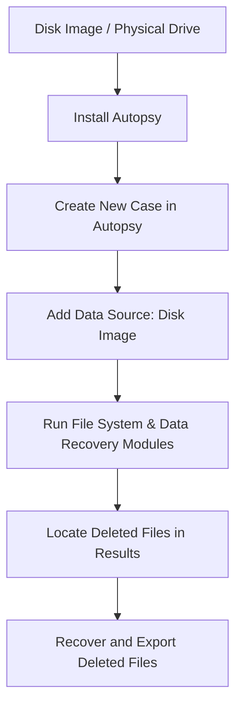

# FILE-RECOVERY-USING-AUTOPSY-SOFTWARE

## AIM
To use **Autopsy Digital Forensics Tool** to retrieve deleted files from a disk image.

---

## REQUIREMENTS
- **Operating System**: Windows 10/11, macOS, or Linux
- **Tool**: [Autopsy Digital Forensics](https://www.autopsy.com/)  
- **Test Data**: Disk image file (`disk.dd`, `disk.img`, `.E01`)

---

## ARCHITECTURE DIAGRAM

## DESIGN STEPS:
### Step 1:
Open Autopsy and create a new case with appropriate case details.

### Step 2:
Add a disk image as a data source and let Autopsy analyze the content.

### Step 3:
Navigate to the "Deleted Files" section in Autopsy and examine or recover the deleted files.

## PROGRAM:
### Install Autopsy
```bash
# Download Autopsy from:
# https://www.autopsy.com/
# Install following the setup wizard.
```
### Create a New Case
```
# File → New Case
# Enter Case Name: Deleted_File_Recovery
# Choose Base Directory: C:\Cases\Deleted_File_Recovery
# Click Finish
```
### Add Disk Image
```
# Add Data Source → Disk Image or VM File
# Browse to: C:\forensics\disk.dd
# Click Next
```
### Run Ingest Modules
```# Select:
# - File System Analysis
# - Keyword Search (optional)
# - Data Recovery / Carving
# Click Finish
```
### Locate Deleted Files
```
# Navigate to 'Deleted Files' section in the tree view
# Review metadata (size, hash, timestamps)
```
### Export Deleted Files
```
# Right-click → Extract File(s)
# Save to: C:\forensics\Recovered_Files\
```

## OUTPUT:
Recovered Deleted File List and Details


## RESULT:
Deleted files were successfully retrieved and analyzed using Autopsy.
